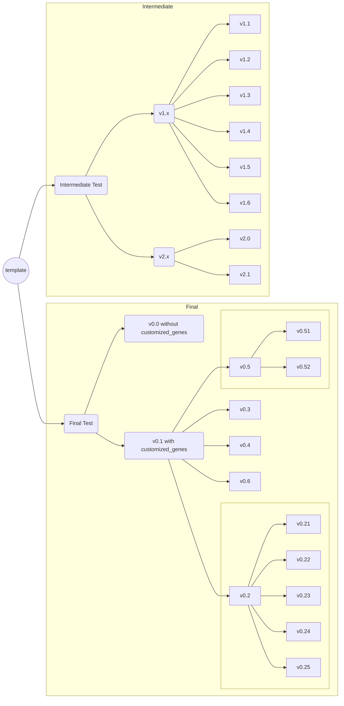

m5C-UBSseq

## Branch Description

### **Final Test**  
- **v0.0**: Baseline test **without** `customized_genes`.  
- **v0.1**: Baseline test **with** `customized_genes`.  
  - **v0.2x**: Parallelization optimization.  
  - **v0.3**: Testing **O3** optimization.  
    - Parallelization of this branch is not fully implemented yet.  
  - **v0.4**: Optimizing `filter_sites` and testing its impact.  
  - **v0.5x**: Testing **O3** optimization with refined parallelization.  
    - **v0.50**: Aggressive optimization strategy.  
    - **v0.51**: Simplified **O3** optimization strategy.  

---

### **Intermediate Test**  

> These versions are **intermediate tests**, not part of the final evaluation, as they use a different reference.  

- **v1.x**: Focused on **parallelization testing**.  
- **v2.x**: Focused on **O3 optimization testing**.  

Fork the respository of https://github.com/y9c/m5C-UBSseq
<a href="https://github.com/y9c" target="_blank">Chang Y</a>

