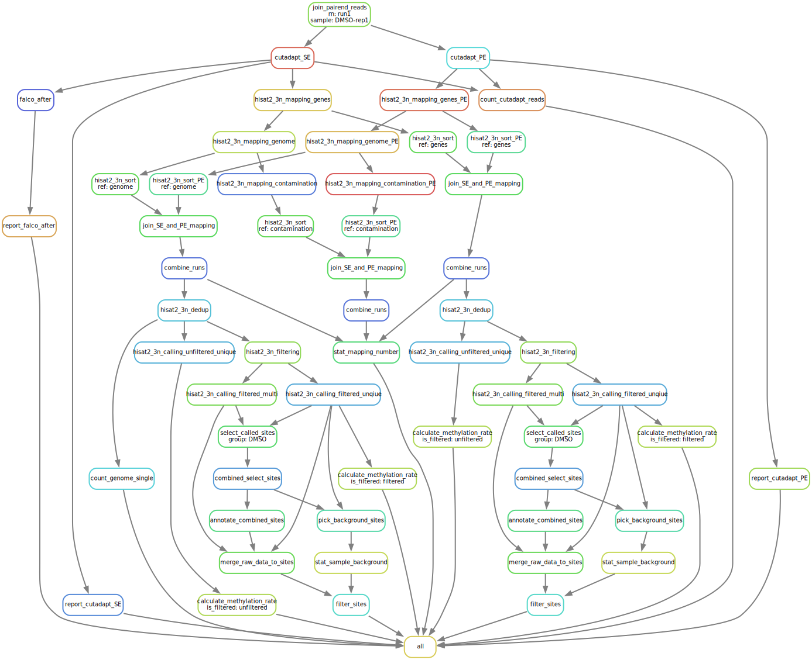

[](https://doi.org/10.5281/zenodo.11046885)

## branch v0.24 在分支 v0.23 基础上进一步测试
修改reference后的基准测试，用rRNA tRNA 作为contamination 和 genes。
* 再加上两个参考基因，customized_genes
  * NSUN2.fa
  * DNMT2.fa

* 本分支v0.2将v1.6分支中 snakefile 的 thread 优化加入进来。
  * dedup_mapping的-Xmx40G的参数未修改。如果发现有内存瓶颈，在下一个分支再添加
  * hisat2_3n_mapping_genes_SE的参数没动，怕影响精度，之后再测试
    ```
      shell:
          """
          {BIN[hisat3n]} \
              --index {params.index} \
              -p {threads} \
              --summary-file {output.summary} \
              --new-summary \
              -q \
              -U {input[0]} \
              --directional-mapping \
              -k 2 \
              --mm \
              --norc \
              --base-change C,T \
              --mp 6,2 \
              --no-spliced-alignment \
              --3N \
              --no-softclip \
              --score-min L,0,-0.1 \
              --dta-cufflinks \
          | {BIN[samtools]} view -@ {threads} -e '!flag.unmap' -O BAM -U {output.unmapped} -o {output.mapped}
          """
    ```
  * hisat2_3n_calling_unfiltered_unique规则，v1.6分支如下所示，v0.2分支只做对线程分配上的优化。
    * v1.6 分支的优化思路
      * thread 合理分配。总共只有16核分配给该rule。
      * 提升缓冲区，加上内存盘
      * 将 pgzip 工具修改为 pigz 工具，加速压缩
    * v0.1 分支是只做 thread 方面的优化
    ```
    # 此为 v1.6 分支的修改，省略其他部分
    params:
        samtools_threads=2,     # 减少samtools线程（I/O瓶颈为主）
        hisat_threads=12,       # 最大化计算核心分配
        bgzip_threads=2,        # 减少bgzip线程（压缩可能受限于输入速度）
        tmpdir="/dev/shm",      # 使用内存盘加速临时文件
    threads: 16
    shell:
        """
        export TMPDIR={params.tmpdir}
        {BIN[samtools]} view \
            -@ {params.samtools_threads} \
            -e "rlen<100000" \
            -h {input} \
        | stdbuf -o 1M \
        {BIN[hisat3ntable]} \
            -p {params.hisat_threads} \
            --alignments - \
            --ref {params.fa} \
            --output-name /dev/stdout \
            --base-change C,T \
        | cut -f 1,2,3,5,7 \
        | {BIN[pigz]} -p {params.bgzip_threads} -c \
        > {output}
        """
    ```

# m<sup>5</sup>C-UBSseq

## Changelog

- 4/23/2024: rewrite code using polars

## workflow

[](https://github.com/y9c/m5C-UBSseq)

## Citation

- cite this software

  ```BibTex
  @software{chang_y_2024_11046885,
      author    = {Chang Y},
      title     = {y9c/m5C-UBSseq: V0.1},
      publisher = {Zenodo},
      version   = {v0.1},
      doi       = {10.5281/zenodo.11046885},
      url       = {https://doi.org/10.5281/zenodo.11046885}
  }
  ```

- cite the method

  ```BibTex
  @article{dai_ultrafast_2024,
      title = {Ultrafast bisulfite sequencing detection of 5-methylcytosine in {DNA} and {RNA}},
      url = {https://www.nature.com/articles/s41587-023-02034-w},
      doi = {10.1038/s41587-023-02034-w},
      author = {Dai, Qing and Ye, Chang and Irkliyenko, Iryna and Wang, Yiding and Sun, Hui-Lung and Gao, Yun and Liu, Yushuai and Beadell, Alana and Perea, José and Goel, Ajay and He, Chuan},
      date = {2024-01-02},
  }
  ```

&nbsp;

<p align="center">

</p>
<p align="center">
Copyright &copy; 2021-present
<a href="https://github.com/y9c" target="_blank">Chang Y</a>
</p>
<p align="center">
